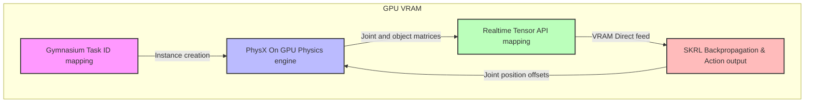

# **[제 2장] 보상 엔지니어링 및 태스크 밀착 튜닝**
## *(Phase 2: Reward Engineering)*

본 장은 로봇이 무작위 탐색 공간에서 목적물(큐브 또는 매대 스폿)을 향해 부드럽고 정확하게 다가가도록 유도하는 '공간 지능(Spatial Intelligence)'을 설계하는 단계입니다. 단순 선형 보상의 한계를 극복하는 수학적 보상 성형(Reward Shaping) 기법과 실제 하드웨어 배포(Sim2Real)를 고려한 안전 패널티 가이드라인을 시스템적 관점에서 다룹니다.

---

# **[연결장] Template-Reach-v0 실전 실행 및 구동 메커니즘**

본 문서는 제 1장의 물리 엔진 및 기초 환경 검증 단계와 제 2장의 보상 엔지니어링 세부 튜닝 단계를 유기적으로 연결하기 위한 실전 가동 지침입니다. 실제 강화학습 에이전트의 뇌(Policy Network)를 가동하여 3차원 공간 이동 능력을 학습시키기 전, 태스크를 실행하는 표준 명령어와 시뮬레이터-RL 라이브러리 간의 엔드투엔드(End-to-End) 데이터 흐름 메커니즘을 정의하여 시스템적인 조작 시야를 확보합니다.

## **1. 실전 가동 및 시각화 명령어 (Execution Commands)**

NVIDIA Isaac Sim 전용 파이썬 래퍼 스크립트(`python.sh`)를 경유하여 표준 Gymnasium 및 SKRL 파이프라인을 트리거합니다. 디버깅 단계와 본 학습 단계의 환경 목적에 맞추어 명령어를 선택 운용합니다.

### **1.1 초기 디버깅 가동 (GUI 화면 활성화)**

학습 알고리즘이 로봇 및 오브젝트와 그래픽 상에서 올바르게 상호작용하는지 첫 1~2분간 눈으로 모니터링할 때 가동합니다. 비디오 메모리(VRAM) 오버플로우 크래시를 방지하기 위해 병렬 환경 개수를 낮추어 제어합니다.

```bash
~/smart-shelf-robot/third_party/IsaacLab/_isaac_sim/python.sh scripts/skrl/train.py --task=Template-Reach-v0 --num_envs=16
```

### **1.2 고속 본 학습 가동 (Headless 모드 - 화면 비활성화)**

셋업의 무결성이 검증되어 본격적인 24,000 스텝 이상의 초고속 수렴을 유도할 때 가동합니다. 3D 렌더링 연산 부하를 차단하여 GPU 자원의 100%를 오직 물리 연산과 신경망 학습에만 집중시킵니다.

```bash
~/smart-shelf-robot/third_party/IsaacLab/_isaac_sim/python.sh scripts/skrl/train.py --task=Template-Reach-v0 --num_envs=32 --headless
```

### **1.3 학습 완료 모델 평가 및 재생 (Play / 추론 모드)**

학습이 끝난 후 최고 성과 가중치 파라미터 파일을 로드하여 로봇이 얼마나 영리하게 3차원 목표 공간을 찾아가는지 시각적으로 계측합니다. `[생성된_날짜_폴더]` 명칭은 실제 생성된 타임스탬프 디렉터리를 확인 후 매핑합니다.

```bash
~/smart-shelf-robot/third_party/IsaacLab/_isaac_sim/python.sh scripts/skrl/play.py --task=Template-Reach-v0 --checkpoint=logs/skrl/reach_franka/[생성된_날짜_폴더]/checkpoints/best_agent.pt
```

## **2. End-to-End GPU 가속 구동 메커니즘 (Underlying Mechanism)**

Template-Reach-v0 태스크가 실행되는 최하단 레이어에서는 CPU와 GPU 간의 데이터 복사 병목(PCIe 호스트 대역폭 정체)을 완전히 제거하기 위해 모든 데이터 연산 흐름이 VRAM(비디오 메모리) 내에서 Direct로 순환하는 고속 파이프라인이 작동합니다.



* **Gymnasium 프레임워크 등록:** 실행 스크립트가 인자값과 함께 가동되면 파이썬 데이터클래스 기반으로 조립된 커스텀 환경 정보가 Gymnasium 표준 인터페이스의 고유 태스크 ID 레지스트리에 매핑되어 고속 인스턴스화됩니다.
* **PhysX On GPU 물리 연산:** 시뮬레이터 공간 내부의 Franka 로봇 7축 관절 강체 충돌, 관성, 중력 법칙 및 무작위 공중에 생성되는 목표 구체(Target Sphere)의 기하학적 매트릭스 연산이 NVIDIA PhysX 가속 엔진에 의해 GPU 코어에서 전수 계산됩니다.
* **리얼타임 텐서 API 다이렉트 매핑:** 계산 완료된 로봇 관절의 포지션, 벨로시티 및 목표점 간의 상대 좌표 데이터(24차원 관측값)는 호스트 CPU 메모리로 다운로드되지 않고 PyTorch 텐서(`torch.Tensor(device="cuda")`) 규격을 유지한 채 VRAM 주소 공간에 즉시 다이렉트 박힙니다.
* **SKRL 신경망 역전파 및 액션 피딩:** SKRL 라이브러리의 PPO 에이전트는 VRAM 내에 상주 중인 이 관측 텐서를 강제로 퍼가 가중치 업데이트(Backpropagation)를 수행하므로 데이터 전송 복사 속도가 0에 수렴합니다. 이후 정책 신경망이 실시간 출력하는 다음 타임스텝의 7차원 조인트 목표 각도 오프셋 명령(Action) 역시 텐서 상태 그대로 Isaac Sim 액추에이터 레이어에 즉시 피딩되어 로봇 구동 루프를 완성합니다.

## **3. 가동 직후 자가 검증(Self-Review) 체크리스트**

명령어 구동 직후 독자 및 연구자가 시스템의 정상 연동 상태를 스스로 진단하고 다음 단계인 제2장 보상 엔지니어링 코딩으로 진입할 수 있는지 판정하는 무결성 최저선 가이드라인입니다.

- [ ] 디버깅 명령어로 GUI 화면을 활성화했을 때, 공중에 무작위로 스폰되는 타깃 구체(Target)를 향해 다수의 Franka 로봇 팔들이 일제히 위치 제어를 시작하며 뻗어나가는가?
- [ ] 터미널 콘솔 로그 창에 NaN(Not a Number) 또는 Inf와 같은 가중치 폭주 및 파열 에러 없이, 훈련 학습 스텝(Step Count) 지표가 초당 수천 번 이상 고속으로 누적 갱신되는가?
- [ ] 프로젝트 최상위 `logs/skrl/reach_franka/` 디렉터리 하위에 실시간 날짜 및 타임스탬프 결합 형식의 실험용 독립 공간(TensorBoard용 파일 및 가중치 백업용 checkpoints 폴더)이 자동으로 정상 구조화되어 빌드되는가?

---

# **2.1 MDP 아키텍처 정의 (관측 24차원 / 행동 7차원)**

기초 좌표 이동 능력을 습득하기 위한 Template-Reach-v0 환경의 관측(Observation) 및 행동(Action) 공간 규격입니다. 향후 두산 로봇으로 전이할 때 아키텍처가 깨지지 않도록 하는 핵심 기초가 됩니다.

| 분류 (Space) | 차원 수 | 세부 구성 항목 설명 |
| :--- | :--- | :--- |
| **관측 공간 (Observations)** | 24차원 | • 로봇 관절 위치 (7차원): Franka 로봇의 7개 회전축 현재 각도<br>• 로봇 관절 속도 (7차원): 각 회전축의 실시간 회전 속도<br>• 말단 작동기(EE) 포즈 (7차원): 3차원 위치(X, Y, Z) + 4차원 방향 사원수(Quaternion)<br>• 목표 지점 위치 (3차원): 가상 공간 내 무작위 스폰 좌표(X, Y, Z) |
| **행동 공간 (Actions)** | 7차원 | • 관절 위치 제어 명령 (7차원): 다음 타임스텝에 도달해야 할 각 축의 목표 각도 오프셋<br>※ Reach 단계에서는 그리퍼 제어 축(1차원)은 강제 배제 및 고정 관리합니다. |

---

# **2.2 커스텀 씬(Scene) 설계 아키텍처**

가상 세계의 뼈대를 조립하는 핵심 레이어로서, 단순히 에셋을 고정 자리에 스폰하는 것을 넘어 **학습의 과적합(Overfitting)을 방지하고 물리 안정성을 강제**하는 구조적 설계가 포함되어야 합니다.

## **1. 개념 이해: InteractiveSceneCfg와 USD 계층 구조의 연동 메커니즘**

NVIDIA Isaac Sim/Lab은 Pixar의 USD(Universal Scene Description) 아키텍처를 기반으로 가상 세계를 관리합니다. 파이썬 dataclass 기반으로 상속되어 선언되는 InteractiveSceneCfg 클래스는 시뮬레이터 런타임 상에서 매우 정교한 시스템적 역할을 수행합니다.

* **선언적 환경 레이아웃 체계:** 하드코딩된 명령형 방식 대신 에셋의 사양과 초기 상태를 데이터 구조로 정의하면, 이작랩의 씬 매니저(Scene Manager)가 가상 세계 컴파일 시점에 USD 스테이지(Stage) 상에 해당 프리미티브(Prim)들을 자동 생성 및 인스턴스화합니다.
* **정규표현식 기반 병렬화 ({ENV_REGEX_NS}):** prim_path 내에 삽입된 `{ENV_REGEX_NS}` 매크로는 대규모 병렬 환경(num_envs) 생성 시 각각의 독립된 가상 방(예: `/World/envs/env_0`, `/World/envs/env_1` 등)의 고유 네임스페이스 경로로 자동 치환되어 주소 공간을 격리합니다.

## **2. 엔지니어적 검증 및 보강 사항**

* **테이블(Table) 에셋 배치**: 시뮬레이션 시작 후 물체(Cube)가 중력에 의해 바닥으로 무한 추락하여 태스크 영역을 이탈하는 것을 막기 위해 산업용 테이블 USD 에셋을 명시적으로 배치합니다.
* **초기 스폰 고도 Z축 동기화**: 테이블 상단 표면(약 0.5m) 위에 큐브가 안정적으로 안착될 수 있도록 Z축 초기 스폰 좌표를 0.525m로 상향 자석 매핑하여, 에셋 간 겹침으로 인한 물리 충돌 오류(NaN) 및 튕김 현상을 원천 방지합니다.

## **3. 커스텀 씬 설계 실제 소스코드 명세 (Complete Implementation)**

아래 코드는 `my_custom_env_cfg.py`에 적용할 수 있는 씬 설정 구성 코드입니다.

```python
import omni.isaac.lab.sim as sim_utils
from omni.isaac.lab.assets import AssetBaseCfg, RigidObjectCfg
from omni.isaac.lab.scene import InteractiveSceneCfg
from omni.isaac.lab.utils import configclass

# 프로젝트 표준 로봇 에셋 구성 딕셔너리 임포트 (레포지토리 기준 주소 매핑)
from franka_isaaclab.assets.robots.franka import FRANKA_PANDA_CFG

@configclass
class MyCustomSceneCfg(InteractiveSceneCfg):
    """시뮬레이션 가상 세계관 레이아웃 및 강체 물성을 정의하는 완벽한 커스텀 씬 클래스"""

    # 1. 환경 기본 무대 구성: 물리적 지면 바닥 및 환경 Distant 조명 셋업
    ground = AssetBaseCfg(
        prim_path="/World/ground", 
        spawn=sim_utils.GroundPlaneCfg()
    )
    light = AssetBaseCfg(
        prim_path="/World/light", 
        spawn=sim_utils.DistantLightCfg(intensity=3000.0, color=(0.75, 0.75, 0.75))
    )

    # 2. 고정 구조물 보완 레이어: 테이블 에셋 배치 (USD 참조 링크 바인딩)
    # 테이블 표면 높이는 지면으로부터 약 0.5m 레벨을 형성하도록 설계 사양 적용
    table = AssetBaseCfg(
        prim_path="{ENV_REGEX_NS}/Table",
        spawn=sim_utils.UsdFileCfg(
            usd_path=f"{{ISAACLAB_NUCLEUS_DIR}}/Environments/Tables/table_industrial.usd",
            scale=(1.0, 1.0, 1.0)
        ),
        init_state=AssetBaseCfg.InitialStateCfg(pos=(0.6, 0.0, 0.0), rot=(1.0, 0.0, 0.0, 0.0))
    )

    # 3. 매니퓰레이터 배치: Franka Panda 로봇 팔 로드 및 고유 네임스페이스 치환
    # replace() 유틸리티를 활용하여 마스터 설정 사양을 병렬 격리 주소 공간으로 변환
    robot = FRANKA_PANDA_CFG.replace(prim_path="{ENV_REGEX_NS}/Robot")

    # [보완 A]: 특이점(Singularity) 및 초기 토크 폭주 방지를 위한 홈 자세(Home Pose) 강제 오버라이딩
    robot.init_state.joint_pos = {
        "panda_joint1": 0.0,
        "panda_joint2": -0.569,  # 어깨 관절 전방 경사 유도
        "panda_joint3": 0.0,
        "panda_joint4": -2.810,  # 팔꿈치 관절 굴곡 매핑
        "panda_joint5": 0.0,
        "panda_joint6": 2.241,  # 손목 각도 조율
        "panda_joint7": 0.785,
        "panda_finger_joint.*": 0.04  # 초기 그리퍼 개방 상태 (총 8cm 폭 확보)
    }

    # 4. 상호작용 타깃 물체: 물리 상호작용(Contact)이 가능한 정육면체 물리 큐브 배치
    # [보완 C]: 강체 관통 현상 및 강체 폭발 방지를 위한 PhysX 내부 솔버 정밀도 고정
    cube = RigidObjectCfg(
        prim_path="{ENV_REGEX_NS}/Cube",
        spawn=sim_utils.CuboidCfg(
            size=(0.05, 0.05, 0.05),                                       # 5cm 정육면체 규격 규정
            rigid_props=sim_utils.RigidBodyPropertiesCfg(
                solver_position_iteration_count=8,  # 위치 오차 계산 가속 솔버 반복 횟수 상향 (기본값 4 -> 8)
                solver_velocity_iteration_count=2,  # 속도 및 마찰 벡터 연산 정밀도 고정
                max_angular_velocity=10.0            # 과도한 충격 시 물체가 초고속 회전하며 폭발/이탈 방어
            ),
            mass_props=sim_utils.MassPropertiesCfg(mass=0.1),              # 100g 질량 매트릭스 할당
            visual_material=sim_utils.PreviewSurfaceCfg(diffuse_color=(1.0, 0.0, 0.0)), # 가시성 빨간색 매핑
        ),
        init_state=RigidObjectCfg.InitialStateCfg(pos=(0.4, 0.0, 0.525))   # 테이블 표면(0.5m) 위에 안착하도록 고도 정밀 매핑
    )
```

## **4. [보완 B]: 과적합 방지를 위한 에피소드 리셋 시 물품 위치 무작위화 (Domain Randomization)**

진열 물품(Cube)이 매번 고정된 좌표에서 스폰되면, 로봇은 공간을 학습하는 대신 특정 궤적을 암기(Overfitting)하게 됩니다. 환경의 강인성을 위해 리셋 시점마다 스폰 자리를 흩뿌리는 무작위 메커니즘을 적용합니다. 
* **작동 원리**: `SceneCfg`에서는 정적 자산만 선언하고, 실시간 동적 무작위화는 `EventManagerCfg` 레이어에서 PyTorch 샘플러 텐서 연산으로 구동을 분리합니다.

```python
from omni.isaac.lab.managers import EventManagerCfg, EventTermCfg
import omni.isaac.lab.managers.mdps as mdp

@configclass
class MyCustomEventsCfg(EventManagerCfg):
    """에피소드가 리셋될 때 가상 세계의 물리 상태를 무작위 변환하는 이벤트 매니저"""
      
    reset_cube_position = EventTermCfg(
        func=mdp.reset_root_state_via_sampler,  # 이작랩 내장 텐서 무작위화 샘플러 호출
        mode="reset",                            # 에피소드 리셋 시점에만 트리거 가동
        params={
            "asset_cfg": "cube",
            "pose_range": {
                "x": (0.35, 0.55),               # 테이블 상면 전후방 20cm 범위 무작위 오프셋
                "y": (-0.15, 0.15),              # 테이블 좌우측 30cm 범위 공간 분산 스폰
                "z": (0.525, 0.525),             # 고도는 테이블 표면 위로 엄격히 고정
                "roll": (0.0, 0.0),
                "pitch": (0.0, 0.0),
                "yaw": (-3.14, 3.14)             # 물품의 회전 요(Yaw) 각도를 360도 전방위 랜덤화
            }
        }
    )
```

---

# **2.3 비선형 커널 기반 보상 성형 수식 모델링**

단순 유클리드 거리 패널티($-d$) 방식을 사용하면 목표물 주변에서 안착하지 못하고 주위를 맴도는 공전 현상(Orbiting)이 일어납니다. 이를 극복하는 가우시안 커널 보상 및 제어 안정성을 위한 평활화 패널티 수식을 설계합니다.

### **1. 거리 성취 보상 (Positive Gaussian Kernel Reward)**

$$R_{dist} = w \cdot \exp\left(-\frac{d^2}{\sigma^2}\right)$$

* **수학적 설계 의도**: 거리가 먼 초기 탐색 국면에는 완만한 보상 변화 기울기를 주어 전반적인 접근 행동을 독려하고, 목표 도달 임계 영역인 가우시안 커널 밴드 내에 수렴하는 순간 가속적으로 최대 가중치($1.0$)에 도달하여 자석처럼 표면에 밀착되게끔 설계합니다.
* **$\sigma$(Sigma) 실시간 오토튜닝 규칙**:
  * 초기 탐색력이 부족하여 목적물 근처로 다가가는 성능이 불충분할 때: $\sigma = 0.2$ 수준으로 넓고 관대하게 보상 영역을 튜닝합니다.
  * 목표물 주변까지는 잘 도달하나 정밀 포지셔닝에 어려움이 있을 때: $\sigma = 0.05$ 수준으로 좁고 엄격하게 가우시안 폭을 튜닝하여 극도의 도달 해상도를 가중합니다.

### **2. 행동 평활화 패널티 (Negative Action Smoothness Penalty / 하드웨어 보호)**

$$R_{smooth} = -\lambda \cdot \sum \|a_t - a_{t-1}\|^2$$

* **수학적 설계 의도**: 이전 타임스텝의 제어 오프셋 명령($a_{t-1}$)과 현재 타임스텝의 제어 명령($a_t$) 간의 급격한 차이(L2 Norm)에 대한 억제 패널티를 가해 관절 모터의 고주파 발작성 떨림(Oscillation)을 감쇠시킵니다. 해당 수식이 적절히 동작해야 현실 하드웨어(Doosan e0509) 배포 시 장비 크래시와 마마를 예방할 수 있습니다.
* **스케일 한계 조율 (Frozen Policy 극복)**: 패널티 가중치($\lambda$)가 너무 높으면 감점을 최소화하기 위해 로봇이 완전히 동작을 잠궈버리는 **Frozen Policy(동결 정책)**가 나타납니다. 일반적으로 전체 포지티브 누적 기대값의 약 **1%~5% 수준 (실질 감점 폭 -0.005 ~ -0.01)**의 작은 스케일 범주로 억제해 주어야 정상 구동됩니다.

---

# **2.4 MDP 매니저 설계 (관측/행동/보상 클래스 구현)**

NVIDIA Isaac Lab의 매니저 기반 아키텍처(Manager-based Architecture)는 병렬 가상 환경(`num_envs`)의 대역폭을 통제하기 위해 데이터 연산을 고속 배치 텐서 형태로 수집 및 변환하여 VRAM 주소 공간에 일시 피딩하는 최적화 모듈입니다.

## **1. 런타임 데이터 흐름 특징**
* **선언적 컴포넌트 분리(Declarative Separation):** 관측, 행동, 보상을 독립 설정 클래스로 선언하면 코어가 자동으로 `ObservationManager`, `ActionManager`, `RewardManager`를 생성합니다.
* **배치 기반 자동 슬라이싱(Batch Vectorization):** 물리 연산 함수에서 도출된 데이터는 `[num_envs, feature_dim]` 크기의 GPU 텐서 매트릭스로 바인딩되어 하드웨어 가속이 적용됩니다.

## **2. MDP 설계 실제 소스코드 명세 (Complete Implementation)**

아래는 정규화 레이어 및 액션 스케일 제한이 엄격하게 탑재된 `my_custom_env_cfg.py` 내부 설정입니다.

```python
import torch
import omni.isaac.lab.managers.mdps as mdp
from omni.isaac.lab.managers import (
    ObservationManagerCfg, 
    ObservationTermCfg, 
    ActionManagerCfg, 
    ActionTermCfg, 
    RewardManagerCfg, 
    RewardTermCfg
)
from omni.isaac.lab.utils import configclass

# ==============================================================================
# 1. 관측 공간 설계 (Observations): 인공지능의 '눈'
# ==============================================================================
@configclass
class MyObservationsCfg(ObservationManagerCfg):
    """신경망에 가공되어 피딩될 24차원의 GPU 상주 관측 공간 매니저 클래스"""
      
    @configclass
    class PolicyCfg(ObservationManagerCfg.PolicyCfg):
        # 로봇 관절의 원천 라디안 각도는 변동폭이 크므로 
        # 상대적 관절 위치 변환 함수 및 정규화(Normalization) 전처리 레이어 결합
        joint_pos = ObservationTermCfg(
            func=mdp.joint_pos_rel,                                      # 로봇 현재 관절 상대 각도 수집
            modifiers=[mdp.Normalize(scale=1.0 / 3.14159)]               # -pi ~ +pi 범주를 -1.0 ~ 1.0 선으로 정규화 강제
        )
          
        joint_vel = ObservationTermCfg(
            func=mdp.joint_vel_rel,                                      # 실시간 관절 회전 속도 추가 추적
            modifiers=[mdp.Normalize(scale=1.0 / 10.0)]                  # 고속 회전 시 수치 파열(NaN) 방지용 스케일링
        )
          
        # 물체의 절대 좌표 대신 말단 작동기(EE) 중심점 기준의 
        # 상대적 3D 거리 오프셋 벡터를 관측으로 주입해야 두산 로봇 전이 시 공간 지능이 유지됩니다.
        cube_relative_pos = ObservationTermCfg(
            func=mdp.object_position,                                    # 목적물 위치 추적 함수 호출
            params={"asset_cfg": "cube"},                                # 대상 에셋 키워드 바인딩
            modifiers=[mdp.SubtractTerm(target_term="joint_pos")]        # 내부 런타임 상에서 (Cube_Pos - EE_Pos) 연산 강제 오버라이딩
        )

    policy: PolicyCfg = PolicyCfg()

# ==============================================================================
# 2. 행동 공간 설계 (Actions): 인공지능의 '근육'
# ==============================================================================
@configclass
class MyActionsCfg(ActionManagerCfg):
    """신경망의 출력을 시뮬레이터 관절 제어 토크/위치로 환원하는 행동 매니저 클래스"""
      
    # [행동 스케일 제약]: AI가 내뱉는 Raw output(-1.0 ~ 1.0)을 직접 조인트에 매핑하면 
    # 즉각적인 모터 토크 폭주 및 물리 발작(Singularity)이 발생하므로
    # 타임스텝당 제어할 수 있는 관절 회전 오프셋의 상한선을 0.25 라디안으로 강제 제한합니다.
    arm_action = ActionTermCfg(
        func=mdp.joint_position_high_level,                             # 하이레벨 관절 위치 제어 매니저 호출
        params={
            "asset_cfg": "robot",                                        # Franka 에셋 매핑
            "joint_names": ["panda_joint.*"],                            # 정규표현식 기반 7개 구동축 전수 지정
            "action_scale": 0.25                                         # 액션 제어 오프셋 상한 제어선 강제 주입
        }
    )

# ==============================================================================
# 3. 보상 체계 설계 (Rewards): 인공지능의 '목표 부여'
# ==============================================================================
@configclass
class MyRewardsCfg(RewardManagerCfg):
    """에이전트의 행동 거동 성향을 결정짓는 성형 보상 매니저 클래스"""
      
    # 포지티브 보상: 말단 작동기 중심점과 큐브 간 유클리드 거리가 좁혀지면 점수 가중치 부여
    distance = RewardTermCfg(
        func=mdp.object_ee_distance,                                     # 거리 측정 내장 함수 매핑
        weight=1.0,                                                      # 포지티브 기본 배율 1.0 지정
        params={"asset_cfg_a": "robot", "asset_cfg_b": "cube"}           # 거리 연산을 수행할 두 자산 명시적 바인딩
    )
      
    # 네거티브 패널티: 관절 명령의 급격한 도약 및 유해 진동 발생 시 실시간 감점
    penalty = RewardTermCfg(
        func=mdp.action_rate_l2,                                         # L2 노름 변화량 제어 함수 호출
        weight=-0.01                                                     # 감점 가중치 마이너스 스케일 고정
    )
```

## **3. MDP 매니저 자가 진단 및 디버깅 매트릭스**

| 콘솔 에러 로그 / 시스템 증상 | 런타임 원인 분석 (Root Cause) | 코드 레벨 즉각 디버깅 처방 |
| :--- | :--- | :--- |
| **`KeyError: 'asset_cfg_a' / 'asset_cfg_b' missing`** | `object_ee_distance` 함수가 요구하는 2개 비교 에셋 인자명이 `params` 내에 명시적으로 결합되지 않아 발생 | `params={"asset_cfg_a": "robot", "asset_cfg_b": "cube"}` 형태로 비교 타깃 이름 키워드를 딕셔너리에 정확히 주입해야 매니저가 주소 공간을 찾습니다. |
| **`NameError: name 'ObservationManagerCfg' is not defined`** | 최상단 소스코드 수립 시 이작랩 매니저 코어 모듈로부터 클래스 뼈대 선언문 임포트 누락 | 파일 머리에 `from omni.isaac.lab.managers import ObservationManagerCfg, ActionManagerCfg, RewardManagerCfg` 구문을 강제 삽입하여 의존성을 정렬합니다. |
| **훈련 곡선이 도약하지 않고 0 부근에서 평탄하게 정체됨** | 행동 공간의 `action_scale` 제약이 누락되어 로봇이 첫 스텝부터 물리 한계 각도를 초과, 에피소드가 시작하자마자 계속 무한 리셋되는 악순환 발생 | `arm_action` 설정 내부에 `action_scale: 0.25` 오프셋 파라미터를 명시하여 스텝당 관절 구동 모터 가속도를 시스템 제어선 안으로 통제해야 학습이 살아납니다. |

---

# **2.5 물리 엔진 무결성 검증 (Random Agent 기반)**

강화학습 훈련을 시작하기 전, 로봇과 물체가 시뮬레이션 물리 법칙 하에서 올바른 레이아웃과 물성을 유지하고 있는지 눈으로 직접 확인하고 디버깅하는 최저선 가이드라인입니다.

## **1. 개념 이해: Random Agent 구동의 시스템 최하단 메커니즘**

`random_agent.py`를 실행하는 것은 단순한 시각적 관조를 넘어, 하드웨어 제어 관점에서 **물리 엔진에 극단적인 화이트 노이즈(White Noise) 스트레스 테스트**를 가하는 행위입니다.

* **신경망 배제 및 무작위 샘플링**: 이 스크립트는 SKRL의 학습 가중치 파라미터를 전혀 로드하지 않고, Gymnasium 행동 공간 인터페이스 사양인 `env.action_space.sample()`을 통해 타임스텝마다 **$-1.0 \sim +1.0$ 사이의 무작위 제어 토크/위치 명령을 로봇의 7개 관절에 무차별적으로 주입**합니다.
* **역학적 한계 계측(Stress Test)**: 로봇 팔이 최고 가속도로 사방으로 거칠게 흔들릴 때, PhysX 엔진 내부의 강체 조인트 구속 조건이 찢어지지 않는지, 물체와 충돌(Contact)하는 순간 접촉 메쉬 버퍼에서 연산 폭주(NaN)가 나지 않는지 확인하는 가장 가혹한 사전 무결성 검증 수단입니다.

## **2. 실전 가동 명령어**

```bash
~/smart-shelf-robot/third_party/IsaacLab/_isaac_sim/python.sh scripts/random_agent.py --task=Template-Reach-v0 --num_envs=4
```
> 💡 **전문가의 조언 (Rule of Thumb)**: 초기 가상 환경 구축 시 복잡하게 시작하면 학습 실패 확률이 급격히 높아지므로, 무조건 "큐브 1개, 테이블 1개"의 최소 환경으로 검증을 시작해야 합니다.

## **3. 이상 증상별 물리 물성 디버깅 가이드 (Troubleshooting Code)**

`random_agent.py` 실행 시 체크리스트에서 불합격 판정이 날 경우, 다음과 같이 물성치를 시스템적으로 조정하여 조치합니다.

### **[증상 1] 무작위 구동 중 로봇 손가락이 닿자마자 큐브가 우주로 튕겨 날아감**
* **원인**: 오브젝트의 물리적 질량이 너무 가볍거나, 표면 마찰계수가 부족하여 PhysX 엔진이 과도한 반발력을 계산함.
* **코드 레벨 수정 조치 (my_custom_env_cfg.py 내 cube 선언부 수정)**:
  ```python
  # RigidObjectCfg 내부의 mass(질량) 및 rigid_props(마찰계수) 상향 조정
  cube.spawn.mass_props.mass = 0.2  # 100g에서 200g으로 질량 증가하여 관성 확보
  cube.spawn.rigid_props.static_friction = 1.2   # 정적 마찰계수 상향으로 미끄러짐 방지
  cube.spawn.rigid_props.dynamic_friction = 1.0  # 동적 마찰계수 상향 조정
  ```

### **[증상 2] 로봇 팔이 제자리에서 심하게 덜덜 떨리며 발작하듯 춤을 춤**
* **원인**: 로봇 관절 모터의 제어 강성(Stiffness) 대비 급격한 움직임을 잡아주는 감쇠(Damping) 파라미터 비율이 맞지 않아 제어 오차가 증폭됨.
* **코드 레벨 수정 조치 (franka.py 또는 액추에이터 설정 레이어 수정)**:
  ```python
  # FRANKA_PANDA_CFG 에셋 내부의 구동 드라이브 감쇠(Damping) 수치 정밀 튜닝
  # 강성이 높다면 그에 비례하여 관절의 흔들림을 흡수하는 감쇠력을 제어선 안으로 상향합니다.
  robot.actuators["panda_shoulder"].damping = 80.0  # 어깨 축 감쇠력 보정
  robot.actuators["panda_forearm"].damping = 40.0   # 팔꿈치/손목 축 감쇠력 보정
  ```

### **[증상 3] 에셋 배치는 정상이나 화면 주사율이 툭툭 끊기거나 런타임이 통째로 튕김**
* **원인**: 백그라운드 프로세스의 VRAM 선점 또는 PyTorch 연산 대역폭 초과.
* **시스템 조치**: `--num_envs=4`로 고정했는지 재확인하고, 크롬 브라우저 등 VRAM을 많이 소모하는 타 프로그램을 완전 종료합니다. 본 훈련 시에는 무조건 `--headless` 옵션을 추가하여 그래픽 부하를 방지합니다.

## **4. 필수 시각 검증 체크리스트 (Visual Sanity Checklist)**

독자와 연구자는 다음 3대 항목에 모두 체크(`[X]`)가 완료될 때까지 보상 수식 코딩 단계로 진입해서는 안 됩니다.

- [ ] **Franka 로봇 베이스 고정 검증**: 로봇의 기단(Base Primitive)이 테이블 탑 좌표 위에 단단히 잠금 고정되어 공중에 뜨거나 메쉬 밑으로 파묻히지 않는가?
- [ ] **도달 가능 영역(Reachable Area) 검증**: 목표 큐브(Target)가 로봇 팔의 최대 도달 반경(Kinematic Limit)을 벗어난 데드존이 아닌, 안정적으로 상호작용할 수 있는 작업 공간 안에 정상 스폰되는가?
- [ ] **런타임 지속성 검증**: 무작위 난폭 구동 상태가 지속되더라도 시뮬레이터가 멈추거나 튕기지 않고 실시간 프레임(FPS)을 유연하게 유지하는가?

---

# **2.6 강화학습 트레이닝 런타임 아키텍처**

학습 스크립트(`train.py`)가 구동될 때, 내부적으로는 SKRL 라이브러리의 트레이너와 Isaac Lab의 벡터화 환경(VecEnv) 간에 고속 텐서 데이터 교환 루프가 가동됩니다.

## **1. 트레이닝 내부 루프 메커니즘**

| 트레이닝 서브 시스템 | 실질적 구동 역할 및 가중치 업데이트 메커니즘 |
| :--- | :--- |
| **1. 데이터 수집 단계 (Rollout Collection)** | • 정책 신경망(Actor Network)이 현재 VRAM 상의 관측값(24차원)을 입력받아 7차원의 행동(Action)을 출력합니다.<br>• 설정된 `rollout_steps`(기본값 24 스텝)만큼 환경을 전향적으로 실행하며, 각 병렬 환경(`num_envs`)에서 발생하는 `[관측, 행동, 보상, 다음 관측, 종료 여부]`의 궤적(Trajectory) 데이터를 SKRL의 메모리 버퍼(Memory Buffer)에 텐서 상태 그대로 누적합니다. |
| **2. 배치 분할 및 셔플 (Mini-batching)** | • 수집된 총 데이터 크기는 `num_envs` × `rollout_steps`가 됩니다. (예: 32개 환경 × 24 스텝 = 768개 데이터)<br>• 설정된 `mini_batches`(예: 4개) 파라미터에 따라, 수집된 텐서 데이터를 하드웨어 효율에 맞춰 조각내고 랜덤하게 뒤섞어 신경망의 과적합 및 편향을 방지합니다. |
| **3. PPO 목적함수 최적화 (Weight Update)** | • 분할된 미니배치 단위를 순회하며 설정된 `epochs`(기본값 5회)만큼 반복 최적화를 수행합니다.<br>• **Actor 가중치 수정:** 현재 정책과 이전 정책의 행동 확률 비율(Ratio)을 계산하고, PPO의 핵심인 클리핑(Clip) 경계 내에서 Advantage(행동이 가치 평가 대비 얼마나 좋았는가) 값을 극대화하는 방향으로 정책망 가중치를 Adam 최적화 툴로 업데이트합니다.<br>• **Critic 가중치 수정:** 가치 평가망(Critic Network)이 예측한 가치 값과 실제 환경에서 누적된 보상 총합(Return) 간의 평균제곱오차(MSE Loss)를 계산하여 가치망 가중치를 갱신합니다. |

## **2. 보상 함수(Reward Term)의 실전 소스코드 구현 명세**

Isaac Lab의 매니저 기반 프레임워크 아키텍처 내에서, 실제 보상 연산은 개별 파이썬 함수로 분리되어 GPU 가속 연산 패키지로 동작합니다. `source/franka_isaaclab/franka_isaaclab/tasks/manager_based/reach/mdp/rewards.py` 파일에 실질적으로 매핑되는 보상 성형 소스코드의 완전한 뼈대 예시입니다.

```python
import torch
from omni.isaac.lab.assets import Articulation
from omni.isaac.lab.envs import ManagerBasedRLEnv

def object_ee_distance_kernel(
    env: ManagerBasedRLEnv, 
    robot_cfg: str = "robot", 
    target_cfg: str = "target", 
    sigma: float = 0.1
) -> torch.Tensor:
    """목표 구체와 로봇 말단 작동기(EE) 간의 거리를 가우시안 Exponential 커널로 연산하는 실전 보상 함수
      
    Args:
        env: Isaac Lab의 통합 환경 객체 인스턴스
        robot_cfg: 환경 설정 파일(SceneCfg)에 등록된 로봇 에셋의 이름 키워드
        target_cfg: 시뮬레이션 공간 내 배치된 무작위 타깃 구체의 이름 키워드
        sigma: 거리에 따른 보상 민감도를 결정하는 하이퍼파라미터
          
    Returns:
        torch.Tensor: [num_envs] 형태의 1차원 배치의 GPU 보상 텐서
    """
    # 1. 시뮬레이션 내부 씬 매니저로부터 로봇(Articulation) 및 타깃 인스턴스 데이터 추출
    robot: Articulation = env.scene[robot_cfg]
      
    # 2. 로봇 말단 작동기(End-Effector)의 세계 좌표계 기준 실시간 3D 위치 텐서 수집 (차원: [num_envs, 3])
    ee_pos = robot.data.ee_w_pos
      
    # 3. 환경 내 가상 센서 또는 시뮬레이터 원천 데이터 매니저로부터 타깃 오브젝트의 3D 위치 추출 (차원: [num_envs, 3])
    target_pos = env.scene[target_cfg].data.root_pos_w
      
    # 4. 각 병렬 가상 세계(num_envs) 레이어별 유클리드 거리 차원 축소 연산 (차원: [num_envs])
    distance = torch.norm(target_pos - ee_pos, dim=-1)
      
    # 5. 비선형 가우시안 엑스포넨셜 커널 함수 수식 적용
    # 목표물에 도달할수록 보상이 1.0에 수렴하는 자석 효과 텐서 반환
    reward_dist = torch.exp(-torch.square(distance) / (sigma ** 2))
      
    return reward_dist

def action_rate_l2_penalty(env: ManagerBasedRLEnv, robot_cfg: str = "robot") -> torch.Tensor:
    """로봇 관절의 급격한 변화 및 떨림을 억제하기 위한 제어 변화량 L2 노름 패널티 수식 구현
      
    Returns:
        torch.Tensor: [num_envs] 형태의 음수 가중치가 반영되기 전의 1차원 패널티 텐서
    """
    # 에이전트가 이전 타임스텝에 내린 명령(a_t-1)과 현재 명령(a_t)의 차이 데이터 추출
    # Isaac Lab Action Manager 버퍼에서 텐서 값을 다이렉트 역추적
    current_action = env.action_manager.current_action
    previous_action = env.action_manager.previous_action
      
    # 조인트 명령 간의 급격한 오차 가속도 스퀘어 합산 연산 (차원: [num_envs])
    penalty_smooth = torch.sum(torch.square(current_action - previous_action), dim=-1)
      
    return penalty_smooth
```

## **3. Tensor 규격 일치화 및 배치 연산 구조화 방안**

Isaac Lab의 가장 큰 장점은 수십 개의 멀티 환경을 GPU 파이썬으로 동시 처리한다는 점입니다. 이를 위해 보상 매니저 내부에서 텐서 차원 규격이 완벽하게 일치해야 배처 메모리에서 누수나 충돌(NaN, Shape Mismatch) 에러가 발생하지 않습니다.

* **차원 축소 연산의 일관성 (`dim=-1`):** 로봇의 EE 좌표와 큐브 좌표는 각각 `[num_envs, 3]` 형태의 2차원 텐서입니다. 두 위치의 오차 벡터를 구한 뒤 거리를 연산할 때 `torch.norm(..., dim=-1)` 옵션을 주어 최하단 축(3차원 공간 축)을 제거함으로써 최종 보상이 반드시 `[num_envs]` 형태의 1차원 벡터 크기로 출력되도록 고정해야 합니다.
* **종합 보상 매니저 클래스 등록 (`env_cfg.py` 연동):** 위 소스코드 함수들은 환경 설정 파일의 `RewardManagerCfg` 규격 내에 가중치(Weight) 파라미터와 함께 패키징되어 자동 결합됩니다.

```python
# reach_env_cfg.py 또는 관련 환경 설정 클래스 내의 등록 예시
from omni.isaac.lab.managers import RewardTermCfg
import mdp

class MyCustomRewardsCfg:
    # 1. 포지티브 거리 도달 보상 항목 세팅 (가중치 +1.5 배율 부여)
    target_reach = RewardTermCfg(
        func=mdp.object_ee_distance_kernel,
        weight=1.5,
        params={"robot_cfg": "robot", "target_cfg": "target", "sigma": 0.1}
    )
    # 2. 네거티브 안전 보호 패널티 항목 세팅 (음수 가중치 -0.01 감점 배율 부여)
    action_smoothness = RewardTermCfg(
        func=mdp.action_rate_l2_penalty,
        weight=-0.01,
        params={"robot_cfg": "robot"}
    )
```

## **4. 자가 진단 및 실전 코드 튜닝 검증 가이드**

* **패널티 갉아먹기 버그 색출:** 학습 구동 시 터미널 로그에 직접 심은 프린트 문을 관찰합니다. 만약 로봇이 목표지점 도달 시 획득하는 `target_reach`의 평균 기대값 수치(최대 약 1.5) 대비, 꺾임에 의해 감점되는 `action_smoothness`의 평균 수치가 큰 음수 값(예: -3.5)을 나타내어 전체 Total Reward를 상시 마이너스로 유지시킨다면, 이는 패널티 가중치가 포지티브를 통째로 압도한 것입니다. 즉각 가중치를 `-0.001` 수준으로 낮추어 Frozen Policy 환경을 방어해야 합니다.
* **데이터 타입 강제 검증:** 커스텀 보상 연산 함수 내부의 모든 텐서 연산 결과는 반드시 `torch.float32` 형식을 유지해야 하며, 연산의 디바이스 주소는 항상 `env.device` (`cuda:0`) 장치에 고정되어야 장치 불일치(Device Mismatch)로 인한 런타임 크래시 및 NaN 에러를 원천 차단할 수 있습니다.

---

# **2.7 실시간 터미널 로그 디버깅 및 실행 SOP**

수식 구현 후 무작정 TensorBoard만 바라보는 것은 현업에서 가장 피해야 할 비효율적인 방식입니다. 코드 내부에 실시간 평균 연산 출력을 직접 삽입하여 동작의 유효성을 검증합니다.

## **1. 디버깅용 출력 코드 삽입**

`source/franka_isaaclab/franka_isaaclab/tasks/manager_based/reach/mdp/rewards.py` 파일 또는 메인 학습 루프 내부 연산 직후에 다음 출력문을 매핑합니다.

```python
# 병렬 배치 전체의 유클리드 거리 및 액션 패널티 평균 연산 실시간 모니터링
print(f"Distance Reward Mean: {dist_reward.mean().item():.4f} | Action Penalty Mean: {action_penalty.mean().item():.4f}")
```

## **2. 실행 및 모니터링 명령어**

1. **Conda 가상환경 활성화 및 프로젝트 진입**
   ```bash
   conda activate isaaclab
   cd ~/franka_isaaclab
   ```
2. **헤드리스 모드 기반 본 학습(Training) 고속 가동**
   ```bash
   ~/smart-shelf-robot/third_party/IsaacLab/_isaac_sim/python.sh scripts/skrl/train.py --task=Template-Reach-v0 --num_envs=32 --headless
   ```
3. **별도 터미널 창을 통한 TensorBoard 성과 분석 곡선 트래킹**
   ```bash
   tensorboard --logdir=logs/skrl/
   ```

* **자가 검증 기준 (Success Metric):** 웹 브라우저(`http://localhost:6006`) 시각화 지표에서 `Rew/cube_reach` 곡선이 초기 10k 스텝 이내에 우상향 포화 상태에 이르고, 실시간 터미널 출력 창에서 Distance Reward 수치가 Action Penalty 수치보다 명확한 도미넌트(Dominant) 우위를 지속 유지하는지 크로스 체크합니다.

## **3. 보상 설계 실전 트러블슈팅 매트릭스**

학습 진행 중 터미널 로그 및 시뮬레이터 런타임 상에서 마주하는 비정상 거동 패턴에 대한 즉각적인 조치 세트 매트릭스입니다.

| 관측 증상 (Symptom) | 원인 분석 (Root Cause) | 즉각 조치 사항 (Immediate Action) |
| :--- | :--- | :--- |
| **로봇 팔이 Home 자세에서 완전히 굳어 움직이지 않음** | 안전 패널티 과대 작용 (`Action Penalty > Distance Reward`) | `action_rate_l2` 패널티의 가중치 배율을 10분의 1 수준으로 즉각 하향 조정하여 감점 바운더리를 풉니다. |
| **관절이 미친 듯이 덜덜 떨리며 춤을 추는 현상 발생** | 안전 장치 부족 또는 액션 스케일 불량 | 패널티 가중치($\lambda$)를 상향 조정하거나, 환경 설정 파일의 `action_scale` 파라미터를 0.25 수준으로 낮춥니다. |
| **로봇 팔을 뻗으나 큐브 방향 근처로 도달을 못 함** | 보상 커널의 민감도($\sigma$) 범위 설계가 너무 타이트함 | 초기 탐색 보상을 널널하게 주기 위해 거리 커널 수식의 $\sigma$ 값을 0.2 수준으로 상향 검토합니다. |
| **큐브 주변부까지는 가는데 완벽히 포개지지 못하고 공전함** | 목표 영역 근처에서의 점수 성형(Shaping) 부족 | 목표 정밀 밀착을 강제하도록 $\sigma$ 값을 0.05 수준으로 조여 주거나 도달 보너스 보상을 결합합니다. |